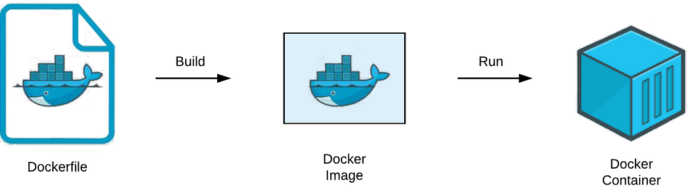

# Docker Notes 🐳

### Docker Images vs Containers

A **Docker Image** is a read-only, lightweight package that includes all the necessary components to run software, built from a Dockerfile and composed of reusable layers.

A **Docker Container** is a running, isolated instance of a Docker image, providing a virtualized environment that can be started, stopped, or deleted.

In summary, images are the blueprints or templates used to create containers. They are static and read-only. Containers are the instances of images. They are dynamic, running, and can be modified while running.

You can run multiple containers from 1 image.

Run the following command in terminal to get the list of all images that are there on your Docker.  
`$ docker images`

Run the following command to get a list of containers.  
`$ docker ps`

### Docker Registries

A storage and distribution system for Docker images. Official images available for applications like Redis, Mongo, Postgres, etc. Official images are maintained by the software authors or in collaboration with the Docker community. Docker hosts one of the biggest Docker registry, called the **Docker Hub**.

### Docker Image Versions

Docker images are versioned. These versions are called **tags**. **latest** tag refers to the latest image that was built.

### Main Docker commands - Pull and Run Docker containers

To download an image from the registry (default is Docker Hub), run the following command: 
`$ docker pull {name}:{tag}` 
`$ docker pull nginx:1.27` 
> If we pull an image without the version tag, it will pull the latest image. $ docker pull nginx.

NOW we have an image locally. But it is only useful if we run it in a container environment.

Run the following command to start a container: 
`$ docker run nginx:1.27` 

If you hit ctrl+c in the terminal, the container will die. In order to run the container in backgroud (in detach mode), use -d or --detach flag. 
`$ docker run -d nginx:1.27` 
Runs container in background, and prints the container ID. 
You may still want to see the logs, which can be useful for debugging, etc. 
`$ docker logs {container_id}` 
`$ docker logs example3c804ea74c1b49fc7112c1e7b21c167f1d751e78312585e47aexample` 

To stop a running container, use following command: 
`$ docker stop {container_id}` 

We can use the run command directly, without even doing a pull of the image. Docker pulls image automatically, if it doesn't find it locally. Example: 
`$ docker run mariadb:11.1` 
> The above command will create a container, but it will throw an error, since MariaDB will need a root password to start.

### Port Binding

The application inside the container runs in an isolated Docker network. So we can't access it from our local computer browser simply. We need to first expose the container to the host (the machine the container runs on). Container runs on a specific port. NGINX runs on port 80. Redis runs on port 6379. 

For that we will have to run the application in the following way: 
`$ docker run -d -p {HOST_PORT}:{CONTAINER_PORT} nginx` 
`$ docker run -d -p 9000:80 nginx` 
(-p or --p = Publish a container port to the host) 
Visit http://localhost:9000 to verify nginx is running. 
Standard to use the same port on your host as your container is using.

> **$ docker run** command creates a new container every time. It does not reuse the container that we created previously. Which means multiple containers will be created. However, if you do **$ docker ps**, only the running container is shown. If you want to check all the previous containers, even the inactive ones, use the following command: 
`$ docker ps -a`

To restart a stopped container, without having to create another new container, run the following command: 
`$ docker start {container_id}` 

> Instead of using id of the container, you can even use the name, which was given by docker. 

`$ docker start {container_name}` 

You can also give a container a specific name while creation. Use --name flag. 
`$ docker run --name surface-tension -d -p 9000:80 nginx` 

To delete a container, run following command: 
`$ docker rm {container_name|container_id}` 

To delete an image, run the following command: 
`$ docker rmi {image_id}` 

### Dockerfile - Dockerize a Node.js app

We want to deploy our app as a Docker container, with the database and other services, that will also run as Docker containers.
For that we need to create a _'definition' of how to build an image from our application_.

That definition is written in a file called Dockerfile. Dockerfile is a text document that contains commands to assemble an image. Docker can then build an image by reading those instructions.

Dockerfiles start from a parent image or **"base image"**, it's a Docker image that your images is based on.

For a JavaScript application, you will have `node` base image.
For Java you will have `tomcat`. For Python you will have `python`.

#### Dockerfile structure

FROM - builds the image from the specified image. 
COPY - copies files or directories from <src> and adds them to the filesystem of the container at the path <dest>. 
WORKDIR - sets the working directory for all the following commands. 
RUN - will execute any command in a shell inside the container environment. 
CMD - the instruction that is to be executed when a Docker container starts. There can only be one CMD instruction in a Dockerfile. 

#### Building an image from the Dockerfile

`$ docker build -t node-app:1.0 .` 
`$ docker build -t {name:tag} {location_of_dockerfile}` 

>-t or --tag sets a name and optionally a tag in the 'name:tag' format.

This creates an image. You can now run the image to build a container.

`$ docker run -d -p 3000:3000 node-app:1.0` 

Now you can visit localhost:3000 to check the running application.
